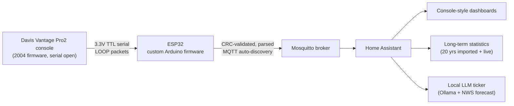

# Davis Vantage Pro2 → ESP32 → Home Assistant

Turning a 20-year-old Davis Vantage Pro2 weather console into a fully smart,
internet-accessible station — live data, two decades of imported history, a
console-style dashboard, and a locally-hosted LLM that narrates the weather —
**without the $235 proprietary data logger.**

> Self-directed hardware/IoT project: reverse-engineered the console's serial
> protocol, bridged it to Home Assistant over MQTT with custom ESP32 firmware,
> and layered on long-term statistics, dashboards, and edge AI.

---

## How it works



The console outputs every reading digitally over its expansion port at 3.3 V TTL.
An ESP32 running custom firmware wakes the console, reads its 99-byte binary
"LOOP" packets, validates each with a CRC-CCITT check, decodes the little-endian
fields, and publishes them to Home Assistant via MQTT auto-discovery. No cloud,
no proprietary logger — three wires and a flash.

---

## Features

- **Custom ESP32 firmware** (`firmware/`) — serial protocol parsing, CRC
  validation, self-healing (UART re-init + scheduled reboot), and on-device
  diagnostics (uptime, RSSI, BSSID/IP, heap, read failures) published to HA.
- **Rejects the console's "no data" sentinels** (`0xFF`, `0xFFFF`, `32767`) so
  garbage readings like "255 mph" or "655.35 in/hr" never get logged.
- **Home Assistant template sensors** (`homeassistant/configuration_helpers.yaml`)
  — wind chill, dew point, heat-index "feels like", cardinal wind direction,
  moon phase, sunrise/sunset, a dynamic barometer-trend arrow icon, and a
  temperature-trend sensor.
- **Decoded Davis forecast** — maps the undocumented `forecast_rule` byte
  (200+ codes) to full forecast sentences using community-reverse-engineered
  lookup tables.
- **20 years of history** imported into HA long-term statistics via the
  websocket API (`scripts/import_history_to_ha.py`), shown alongside live data.
- **Console-style dashboards** (`homeassistant/dashboard.yaml`) — a rotating
  wind compass (custom SVG), mobile + desktop layouts, and a Records tab with
  ApexCharts overlaying archive vs. live yearly/monthly/daily records.
- **Local-AI weather ticker** (`homeassistant/ai_ticker_automation.yaml`) — an
  Ollama LLM summarizes live readings + the official NWS forecast + active NWS
  alerts into a friendly one-line ticker, with guardrails against hallucinated
  forecasts.
- **Off-site backups** — nightly Google Drive backup via rclone
  (`scripts/ha_backup_to_gdrive.ps1`).

---

## Hardware

| Item | Notes |
|---|---|
| Davis Vantage Pro2 console | Firmware pre-2012 (serial port unlocked) |
| ESP32 dev board | Any ESP32; 2.4 GHz Wi-Fi |
| 3 jumper wires | Console TX→GPIO18, RX→GPIO17, GND→GND (3.3 V, no level shifter) |
| USB power supply | A solid 5 V wall adapter — **not** a USB hub |

Total added cost: a few dollars. **Avoided:** the $235 Davis data logger.

---

## Repo layout

```
firmware/davis_vp2_bridge/   ESP32 Arduino firmware (the serial→MQTT bridge)
homeassistant/               template sensors, automation, dashboard, compass SVG
scripts/                     history importer + backup script
docs/                        hardware wiring, AI ticker setup, data cleanup, backups
data/                        historical-data format notes
```

## Setup

1. **Flash the firmware** — `docs/hardware-setup.md` (wiring + Arduino IDE).
2. **Home Assistant** — MQTT/Mosquitto, then paste `configuration_helpers.yaml`
   into `configuration.yaml` and the dashboard into a Sections dashboard.
3. **Import history** (optional) — `scripts/import_history_to_ha.py`
   (see `data/README.md` for the spreadsheet format).
4. **AI ticker** (optional) — `docs/ai-ticker-setup.md` (Ollama + NWS).

Configuration values in the code (Wi-Fi, MQTT host, HA token, station entity IDs)
are placeholders — replace them with your own.

---

## Tech & skills

Embedded C (ESP32) · binary serial protocol reverse-engineering · CRC-CCITT ·
MQTT & Home Assistant auto-discovery · Jinja2 template sensors · long-term
statistics / time-series data · ApexCharts · local LLMs (Ollama) & prompt
engineering · Cloudflare Zero Trust remote access · Docker · rclone backups.

## Author

Built by Lucas Nugent. Electrical engineering student · embedded / IoT hobbyist.

## License

MIT — see [LICENSE](LICENSE).
EOF