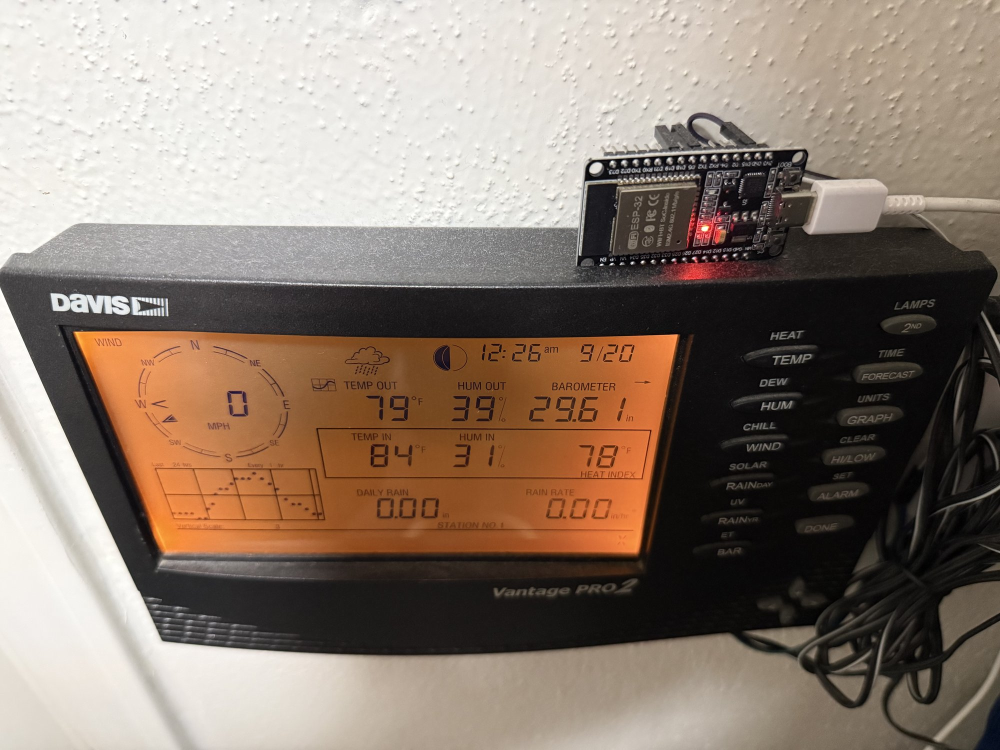
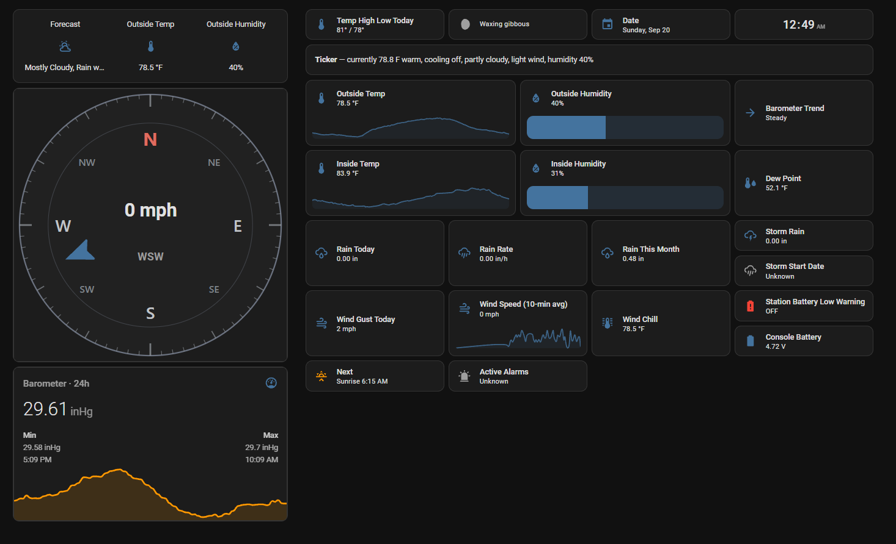
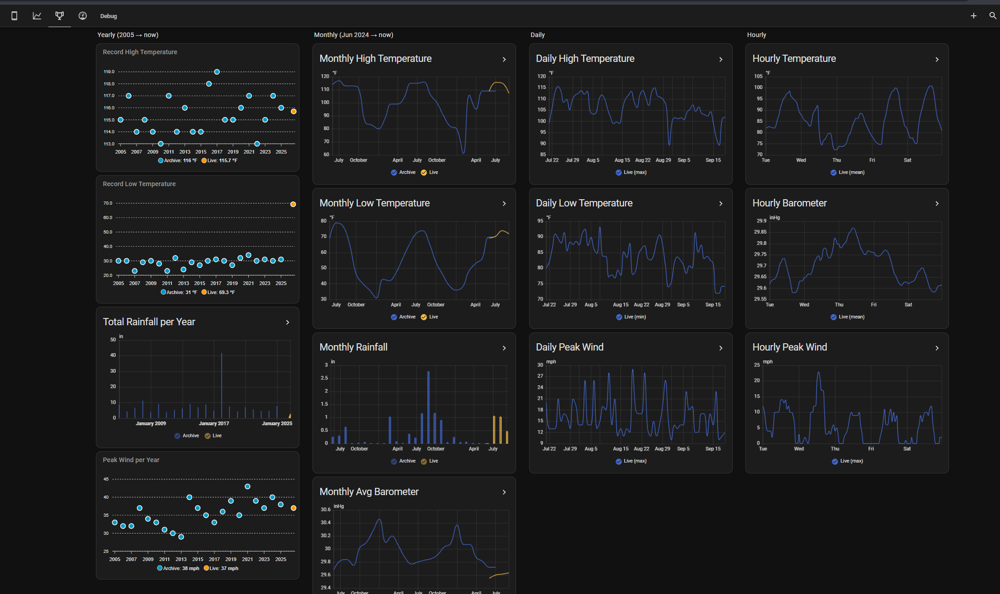
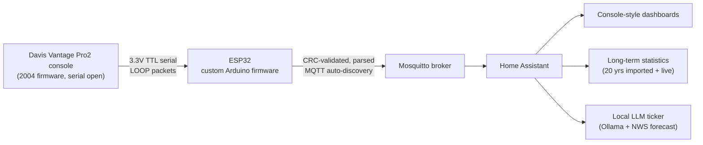

# Davis Vantage Pro2 → ESP32 → Home Assistant

Turning a 20-year-old Davis Vantage Pro2 weather console into a fully smart,
internet-accessible station — live data, two decades of imported history, a
console-style dashboard, and a locally-hosted LLM that narrates the weather —
**without the $235 proprietary data logger.**

> Self-directed hardware/IoT project: reverse-engineered the console's serial
> protocol, bridged it to Home Assistant over MQTT with custom ESP32 firmware,
> and layered on long-term statistics, dashboards, and edge AI.



<sub>Three wires into the expansion port on top of the console — no logger, no case mods, no cloud.</sub>

---

## The dashboard



<sub>The live view: rotating wind compass, AI ticker line, current conditions, and a 24-hour barometer trace.
The readings match the console's own LCD in the photo above.</sub>



<sub>The Records tab — 20 years of hand-logged history (blue) overlaid with live station data (orange),
across yearly, monthly, daily, and hourly granularities. Record highs back to 2005 sit on the same
axes as this morning's readings.</sub>

---

## How it works



The console outputs every reading digitally over its expansion port at 3.3 V TTL.
An ESP32 running custom firmware wakes the console, reads its 99-byte binary
"LOOP" packets, validates each with a CRC-CCITT check, decodes the little-endian
fields, and publishes them to Home Assistant via MQTT auto-discovery. No cloud,
no proprietary logger — three wires and a flash.

---

## Features

- **Custom ESP32 firmware** (`firmware/`) — serial protocol parsing, CRC
  validation, self-healing (UART re-init + scheduled reboot), and on-device
  diagnostics (uptime, RSSI, BSSID/IP, heap, read failures) published to HA.
- **Rejects the console's "no data" sentinels** (`0xFF`, `0xFFFF`, `32767`) so
  garbage readings like "255 mph" or "655.35 in/hr" never get logged.
- **Home Assistant template sensors** (`homeassistant/configuration_helpers.yaml`)
  — wind chill, dew point, heat-index "feels like", cardinal wind direction,
  moon phase, sunrise/sunset, a dynamic barometer-trend arrow icon, and a
  temperature-trend sensor.
- **Decoded Davis forecast** — maps the undocumented `forecast_rule` byte
  (200+ codes) to full forecast sentences using community-reverse-engineered
  lookup tables.
- **20 years of history** imported into HA long-term statistics via the
  websocket API (`scripts/import_history_to_ha.py`), shown alongside live data.
- **Console-style dashboards** (`homeassistant/dashboard.yaml`) — a rotating
  wind compass (custom SVG), mobile + desktop layouts, and a Records tab with
  ApexCharts overlaying archive vs. live yearly/monthly/daily records.
- **Local-AI weather ticker** (`homeassistant/ai_ticker_automation.yaml`) — an
  Ollama LLM summarizes live readings + the official NWS forecast + active NWS
  alerts into a friendly one-line ticker, with guardrails against hallucinated
  forecasts.
- **Off-site backups** — nightly Google Drive backup via rclone
  (`scripts/ha_backup_to_gdrive.ps1`).

---

## Hardware

| Item | Notes |
|---|---|
| Davis Vantage Pro2 console | Firmware pre-2012 (serial port unlocked) |
| ESP32 dev board | Any ESP32; 2.4 GHz Wi-Fi |
| 3 jumper wires | Console TX→GPIO18, RX→GPIO17, GND→GND (3.3 V, no level shifter) |
| USB power supply | A solid 5 V wall adapter — **not** a USB hub |

Total added cost: a few dollars. **Avoided:** the $235 Davis data logger.

---

## Repo layout

```
firmware/davis_vp2_bridge/
    davis_vp2_bridge.ino        ESP32 firmware — the serial→MQTT bridge
homeassistant/
    configuration_helpers.yaml  template sensors (paste into configuration.yaml)
    ai_ticker_automation.yaml   the local-LLM ticker automation
    dashboard.yaml              Mobile / Desktop / Records views
    www/davis_compass.svg       wind compass face → copy to HA's config/www/
scripts/
    import_history_to_ha.py     spreadsheet → HA long-term statistics
    ha_backup_to_gdrive.ps1     nightly rclone backup to Google Drive
    requirements.txt            Python deps for the importer
docs/                           wiring, AI ticker, data cleanup, backups
data/README.md                  expected workbook format for the importer
```

## Requirements

**Hardware** — see the [Hardware](#hardware) table above. The one hard requirement is a
Davis Vantage Pro2 console with **pre-2012 firmware**; Davis locked the serial port on later
units. Check yours under *Setup → Receiving → Version*.

**Software**

| For | You need |
|---|---|
| Firmware | Arduino IDE, the **esp32** board core (Espressif), and the **PubSubClient** library (Nick O'Leary) |
| Home Assistant | Any HA install, plus an MQTT broker (the **Mosquitto** add-on is easiest) and the **MQTT integration** |
| Dashboard | Four [HACS](https://hacs.xyz) frontend cards — see below |
| History import (optional) | Python 3.9+ and `pip install -r scripts/requirements.txt` |
| AI ticker (optional) | [Ollama](https://ollama.com) on any machine with a ~6 GB GPU, plus the NWS integration (US) or Met.no |
| Backups (optional) | [rclone](https://rclone.org), and HA running under Docker on Windows |

**HACS cards required by `dashboard.yaml`** — install all four before importing it, or the
dashboard will render as a column of *"Custom element doesn't exist"* errors:

- [`apexcharts-card`](https://github.com/RomRider/apexcharts-card) — the archive-vs-live record charts
- [`stack-in-card`](https://github.com/custom-cards/stack-in-card) — the grouped card layouts
- [`mini-graph-card`](https://github.com/kalkih/mini-graph-card) — the inline sparklines
- [`card-mod`](https://github.com/thomasloven/lovelace-card-mod) — rotates the wind compass needle

---

## Setup

1. **Flash the firmware** — wiring and Arduino IDE steps in
   [`docs/hardware-setup.md`](docs/hardware-setup.md). Edit the `USER CONFIG` block at the top of
   `davis_vp2_bridge.ino` first: `WIFI_SSID`, `WIFI_PASS`, `MQTT_HOST`, and MQTT credentials.
   On success the serial monitor prints a line of JSON every ~2.5 s.

2. **Home Assistant** — install and start the Mosquitto broker, then confirm the MQTT
   integration is present. Once the ESP32 is running, a device named **Davis Vantage Pro2**
   appears automatically under *Settings → Devices & Services → MQTT*. No YAML needed for
   the sensors themselves — it's all auto-discovery.

   > **Don't rename the device in HA.** Every config file here refers to entities as
   > `sensor.davis_vantage_pro2_*`. Renaming the device regenerates those entity IDs and
   > silently breaks the template sensors and dashboard.

3. **Template sensors** — merge [`homeassistant/configuration_helpers.yaml`](homeassistant/configuration_helpers.yaml)
   into your `configuration.yaml`. It defines `template:`, `input_text:`, and `binary_sensor:`
   blocks; if you already have any of those keys, merge the entries under your existing block
   rather than adding a second key. Then *Developer Tools → YAML → Check Configuration* → restart.

4. **Compass image** — copy [`homeassistant/www/davis_compass.svg`](homeassistant/www/davis_compass.svg)
   into your HA config folder at `config/www/davis_compass.svg`. HA serves that folder at `/local/`,
   which is where the dashboard looks for it. Create `config/www/` if it doesn't exist, and restart
   HA once after adding the folder for the first time.

5. **Dashboard** — install the four HACS cards listed above, then create a new dashboard,
   switch it to **Sections** layout, open the raw YAML editor (⋮ → *Edit in YAML*), and paste
   [`homeassistant/dashboard.yaml`](homeassistant/dashboard.yaml). It ships Mobile, Desktop, and
   Records views.

6. **Import history** *(optional)* — `pip install -r scripts/requirements.txt`, create a
   long-lived access token in HA (*your profile → Security → Long-lived access tokens*), set
   `HA_HOST`, `TOKEN`, and `TZ_OFFSET` at the top of
   [`scripts/import_history_to_ha.py`](scripts/import_history_to_ha.py), then run it. See
   [`data/README.md`](data/README.md) for the workbook format.

7. **AI ticker** *(optional)* — [`docs/ai-ticker-setup.md`](docs/ai-ticker-setup.md) covers Ollama,
   the NWS integration, and the automation in
   [`homeassistant/ai_ticker_automation.yaml`](homeassistant/ai_ticker_automation.yaml).

8. **Backups** *(optional)* — [`docs/backup-setup.md`](docs/backup-setup.md) sets up the nightly
   rclone job to Google Drive.

Every credential and host in this repo is a placeholder — `YOUR_WIFI_SSID`, `192.168.1.100`,
`PASTE_YOUR_HA_LONG_LIVED_ACCESS_TOKEN_HERE`, `weather.nws_YOURSTATION`. Replace them with
your own; none of them are real.

### Troubleshooting

`docs/hardware-setup.md` has a fuller table, but the two most common first-run problems:
**no data at all** → swap the RX/TX wires (harmless at 3.3 V, and the labels trip everyone up);
**constant CRC failures** → check the ground connection and confirm the console is on its main
display, not a setup screen.

---

## Running it day to day

**Home Assistant needs a permanent home.** This build runs HA as a Docker container on an
always-on Windows machine, which is what the backup script assumes — it stops the container,
zips the config folder, and restarts it, so the SQLite database is never copied mid-write.
Docker is the practical choice on Windows or an existing server: HA ships an official image,
upgrades are a pull-and-recreate, and the whole config is one bind-mounted folder that the
backup script can grab. A dedicated Home Assistant OS install (Raspberry Pi, mini PC) works
just as well — the only thing that changes is the backup step, since HA OS has its own
built-in backup system and the PowerShell script wouldn't apply.

One Docker-specific gotcha worth knowing: inside the container, `localhost` is the container,
not the host. Anything running on the host — Ollama, most commonly — has to be reached by the
host's LAN IP instead, and has to be listening on more than loopback. `docs/ai-ticker-setup.md`
covers that for Ollama specifically.

**Remote access** is handled with a Cloudflare Zero Trust tunnel, so the dashboard is reachable
from outside the house without forwarding a port, exposing the HA instance directly, or paying
for Nabu Casa. An outbound-only connector means nothing inbound is opened on the router, and
authentication sits in front of the dashboard rather than relying on HA's login alone.
Setting it up is well covered by Cloudflare's own docs and is independent of everything here —
the station works entirely on the LAN without it.

---

## Tech & skills

Embedded C (ESP32) · binary serial protocol reverse-engineering · CRC-CCITT ·
MQTT & Home Assistant auto-discovery · Jinja2 template sensors · long-term
statistics / time-series data · ApexCharts · local LLMs (Ollama) & prompt
engineering · Cloudflare Zero Trust remote access · Docker · rclone backups.

## Author

Built by Lucas Nugent. Electrical engineering student · embedded / IoT hobbyist.

## Acknowledgements

This project stands on prior reverse-engineering work by the weather-station community:

- **DeKay** — [“Davis Weatherlink Software Not Required!!!!”](https://madscientistlabs.blogspot.com/2011/01/davis-weatherlink-software-not-required.html)
  (Mad Scientist Labs, 2011), which first publicly documented the VP2 expansion port. The pinout
  diagram in `docs/hardware-setup.md` is from that post.
- **CumulusMX** — the `forecast_rule` lookup table and forecast phrase list used by the
  “Detailed Forecast” template sensor.
- **Davis Instruments** — the published *Vantage Pro2 Serial Communication Reference Manual*,
  which documents the LOOP packet layout and CRC.

Third-party material is credited where it appears and is not covered by this repository's license.

## License

MIT — see [LICENSE](LICENSE).

The MIT license covers the code and documentation written for this project. It does not extend to
the third-party diagram and lookup tables noted under Acknowledgements.
