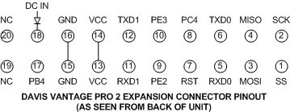

# Davis Vantage Pro2 → ESP32 → Home Assistant

A pre-2012 console (the one this was built against reports firmware **Nov 13 2004**, well before the
serial lockout) outputs every reading
digitally over its expansion port at **3.3 V TTL** — the exact voltage the ESP32 runs at. No camera,
no cloud AI, no data logger. Three wires and a flash.

---

## 1. Parts

| Item | Notes |
|---|---|
| ESP32 dev board | Any ESP32 with a spare hardware UART. Built on an ELEGOO EL-SM-012 (ESP-WROOM-32, USB-C, 520 KB SRAM / 4 MB flash), but an S3 or a plain DevKit v1 works the same. |
| Connector to the console port | The expansion port is a **2×10, 2 mm-pitch** male header. Easiest: a 2 mm IDC socket + ribbon, or carefully fit 2 mm female jumpers onto the 3 pins you need. |
| 3 jumper wires | Console → ESP32. |
| USB-C cable | Powers + flashes the ESP32. |

You do **not** need the $235 logger or any level shifter.

---

## 2. Wiring (3 wires)

The expansion port is on the **back of the console, under the cover** (the slot the logger would plug into).
All three signals are 3.3 V, so a direct connection is safe.

Pinout diagram by DeKay, from
[“Davis Weatherlink Software Not Required!!!!”](https://madscientistlabs.blogspot.com/2011/01/davis-weatherlink-software-not-required.html)
(Mad Scientist Labs, 23 Jan 2011) — the post that first documented this port publicly. Reproduced here
for reference; not covered by this repository's MIT license.

The connector is a 2x10 header, numbered as shown **from the back of the unit** — odd pins on the
bottom row, even pins on the top. Only three of the twenty matter here:

| Console expansion port | → | ESP32 | Meaning |
|---|---|---|---|
| Pin 6 — TXD0 (console transmit) | → | **GPIO 18** (RX) | Console talks, ESP listens |
| Pin 5 — RXD0 (console receive) | → | **GPIO 17** (TX) | ESP talks, console listens |
| Pin 16 — GND | → | **GND** | Common ground (required) |

Rules:
- **Common ground is mandatory.** Without it you get garbage or nothing.
- **Do NOT connect the console's VCC** to the ESP32. Power the ESP32 from USB only.
- **If you get no data, swap the two data wires** (RX↔TX). It's harmless — TX/RX labeling trips everyone up,
  and a swap can't damage anything at 3.3 V.

> Pin numbering on these small headers is easy to misread — count against the diagram above, and note
> that it is drawn as seen from the **back** of the console, so the rows mirror if you look from the front.
> Double-check **GND** in particular before soldering. Worst case of a wrong *data* pin is
> "no readings," not damage — but get **GND** right.

---

## 3. Flash the firmware

1. Install the **Arduino IDE**.
2. Add the ESP32 core: *File → Preferences → Additional Boards URLs*:
   `https://raw.githubusercontent.com/espressif/arduino-esp32/gh-pages/package_esp32_index.json`
   then *Tools → Board → Boards Manager* → install **esp32** (by Espressif).
3. Install the MQTT library: *Tools → Manage Libraries* → search **PubSubClient** (Nick O'Leary) → Install.
4. Open `davis_vp2_bridge/davis_vp2_bridge.ino`.
5. Edit the **USER CONFIG** block at the top:
   - `WIFI_SSID` / `WIFI_PASS`
   - `MQTT_HOST` = your Home Assistant box's IP, `MQTT_USER` / `MQTT_PASS` (set in step 4 below)
6. Select your board — **ESP32 Dev Module** for a classic ESP-WROOM-32, or **ESP32S3 Dev Module**
   for an S3 — pick the COM port, and click **Upload**. If the upload doesn't start, hold the board's
   **BOOT** button while it connects.
7. Open **Serial Monitor** at **115200 baud**. You should see WiFi + MQTT connect, then a line of JSON
   roughly every 2.5 s with your live readings. `CRC fail (frame discarded)` lines occasionally are
   normal and good — that's the firmware throwing out a corrupt frame instead of logging bad data.

---

## 4. Home Assistant side

1. In HA: **Settings → Add-ons → Add-on Store → Mosquitto broker → Install → Start**.
2. **Settings → People/Users** (or the add-on docs): create a HA user for MQTT, e.g. `mqtt_user` with a
   password. Put those into the firmware's `MQTT_USER` / `MQTT_PASS`.
3. Make sure the **MQTT integration** is added (HA usually auto-discovers Mosquitto and offers it).
4. Once the ESP32 is running, a device named **"Davis Vantage Pro2"** appears automatically under
   *Settings → Devices & Services → MQTT*, with these entities:

   **Weather:** Outside Temperature, Inside Temperature, Outside Humidity, Inside Humidity,
   Barometer, Barometer Trend, Wind Speed, Wind Speed (10-min avg), Wind Direction (degrees),
   Rain Rate, Rain Today, Rain This Month, Rain This Year, Storm Rain, Storm Start Date,
   Forecast, Forecast Rule, Active Alarms, Console Battery, Transmitter Battery Low.

   **Diagnostics:** Bridge Uptime, WiFi Signal, Free Memory, Read Failures, Last Status,
   AP (BSSID), IP Address, MAC, WiFi Channel.

   > Leave the device name as **Davis Vantage Pro2**. The template sensors and dashboard
   > refer to entities as `sensor.davis_vantage_pro2_*`; renaming the device in HA
   > regenerates those entity IDs and breaks both.

No YAML required — it's all auto-discovery.

---

## 5. What you're getting vs. the camera plan

- **Exact numbers**, not OCR guesses — every frame is CRC-checked, so corrupt readings are dropped, not logged.
- **Wind direction in real degrees** straight from the console, instead of measuring a compass arrow.
- **The scrolling ticker's forecast** comes through as a decoded value.
- **Zero cloud cost, zero added heat**, runs entirely on your LAN.

---

## 6. Troubleshooting

| Symptom | Fix |
|---|---|
| Serial monitor shows WiFi/MQTT OK but `no ACK` / `console did not wake` | Swap the RX/TX data wires. Re-check GND continuity. Confirm console isn't stuck in a setup/number-entry screen (press DONE). |
| Garbled JSON or constant CRC fails | Wrong baud (console must be 19200 — its default) or a loose ground. |
| Device never appears in HA | Confirm Mosquitto is running and `MQTT_HOST/USER/PASS` are right; watch the add-on log for the connection. |
| Readings freeze | The console sleeps in setup screens; exit to the main display. |

---

## 7. Importing historical records

Separate from the live feed: if you have years of readings logged off the console by hand, they can
be pushed into Home Assistant's long-term statistics so history and live data sit side by side on
the same charts. See [`../data/README.md`](../data/README.md) for the expected workbook format and
[`../scripts/import_history_to_ha.py`](../scripts/import_history_to_ha.py) for the importer.
